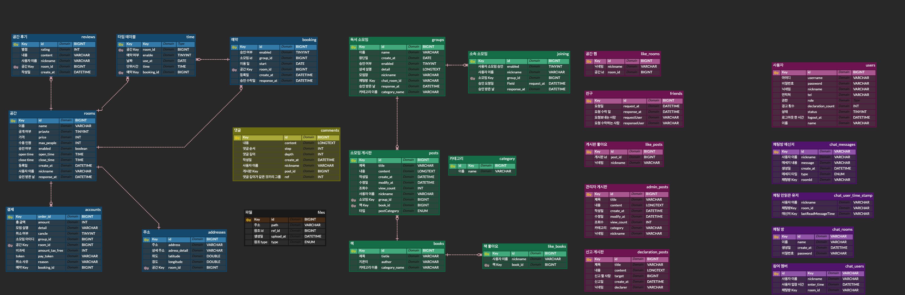
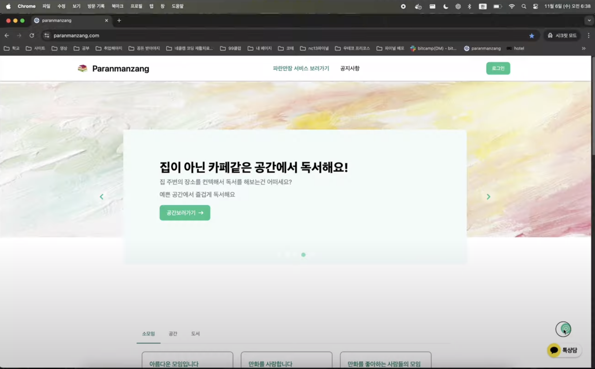

### **PARANMANZANG PROJECT**
**기간:** 2024.08.21 ~ 2024.10.21

저희 플랫폼은 독서 소모임을 쉽게 개설하고 운영할 수 있는 종합 솔루션입니다. 독서를 즐기는 사람들을 연결하여 함께 성장하고 소통할 수 있는 공간을 제공합니다.
### 개발 목적
코로나 엔데믹 이후 사람들은 소통에 대한 갈망을 이루고자 모임과 각종 소모임들이 많아지고 있는 추세입니다. 독서및 자기계발을 위한 소모임의 장을 제공하고자 개발하였습니다.

### **Frontend 기술 스택**
#### **언어 및 빌드 도구**
- TypeScript
- Yarn
#### 프레임워크 & 라이브러리
- React
- Next.js
- Axios
- Redux Toolkit
#### **스타일링**
- Tailwind CSS
- Flowbite
#### **기타**
- JS Cookie

### 시스템  ERD

### 시스템 디자인
엔데믹 이후 휴식을 취하고 쉼과 관련된 디자인으로 구성해서 사람들의 편의와 정서적 안정감을 높이는 것을 목표로 하였습니다.

공간의 흐름, 컬러, 타이포그래피, 인터랙션 등 전반적인 UI/UX 요소를 ‘쉼’이라는 키워드에 맞춰 정돈된 리듬감과 여유를 느낄 수 있도록 설계하였으며, 사용자가 서비스를 이용하면서도 심리적 피로감을 최소화할 수 있도록 구성하였습니다.

또한, 기능적인 측면에서는 복잡한 기능보다는 직관적인 사용 경험에 집중하여, 사용자 누구나 쉽게 접근하고 필요한 정보에 빠르게 도달할 수 있도록 구조화하였습니다. 이러한 방향성은 특히 엔데믹 이후 일상에 복귀한 사용자들에게 디지털 환경 속에서도 휴식의 연장선처럼 느껴지는 경험을 제공하는 데 중점을 두고 디자인 하였습니다.

**초기 레이아웃 구성**
.png)